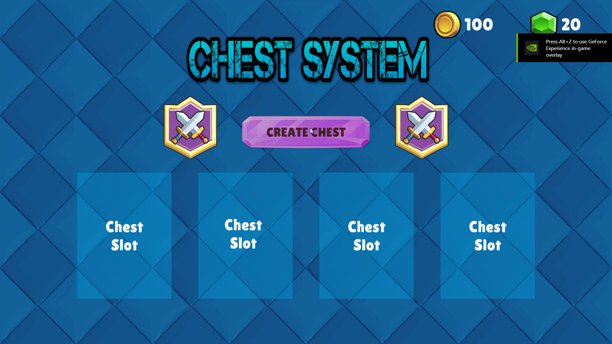
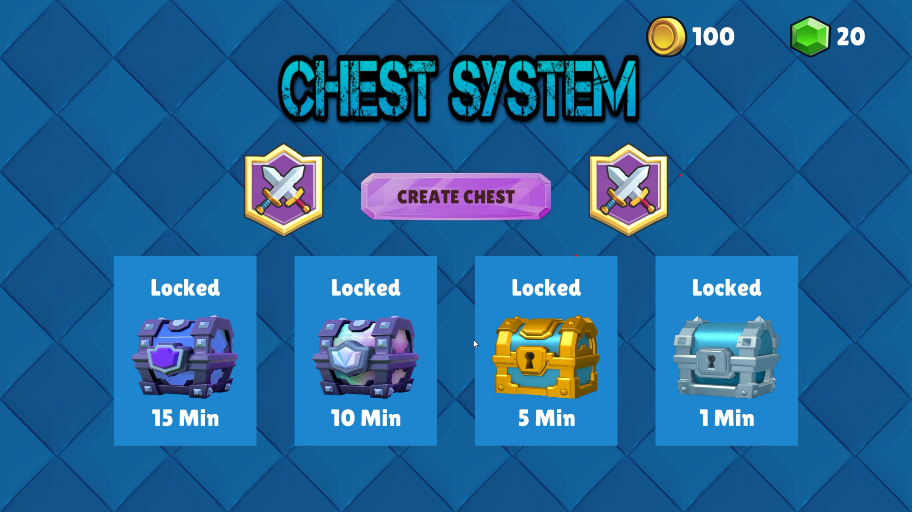
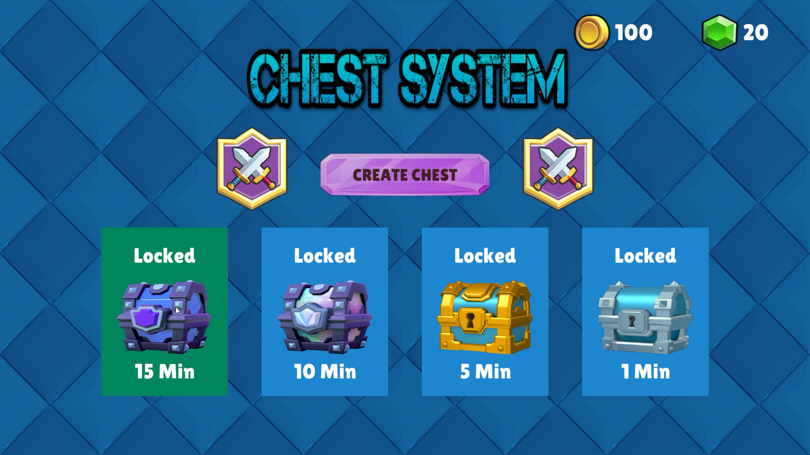
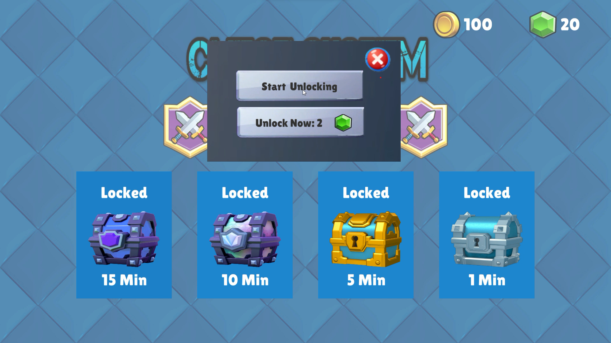
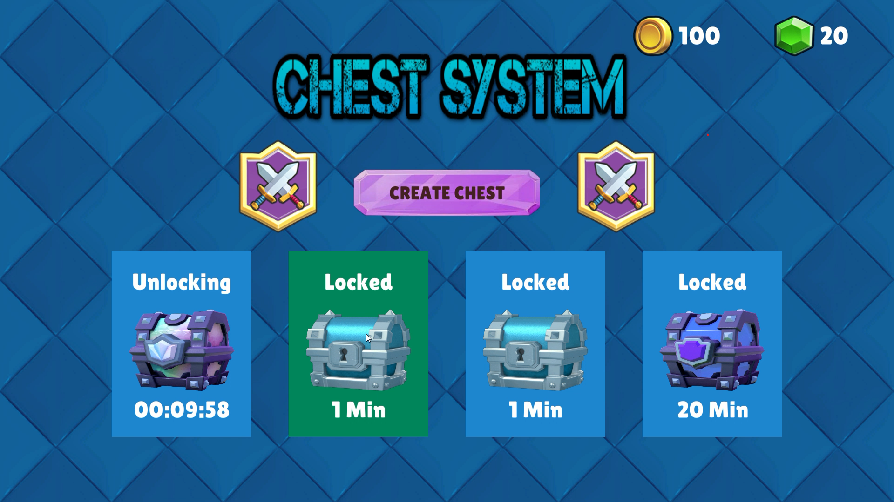
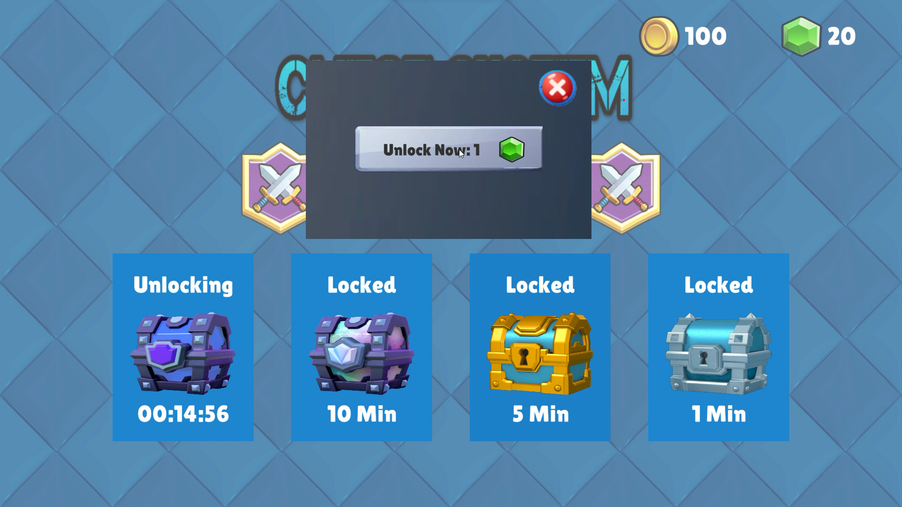
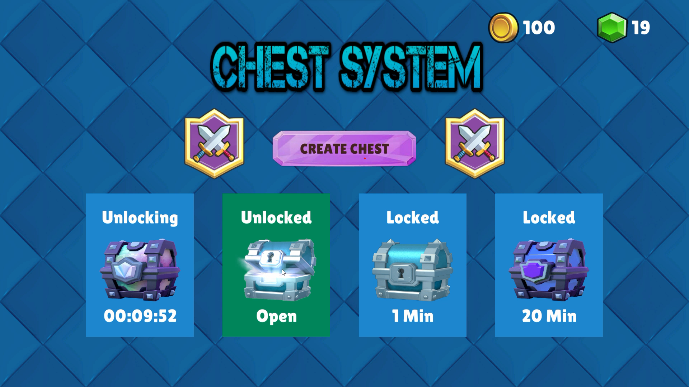
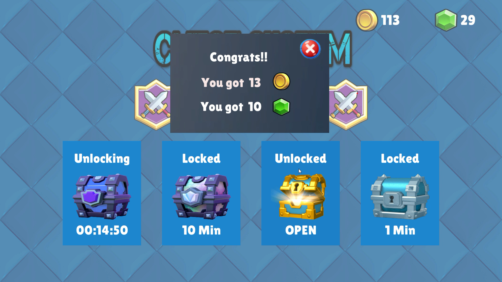
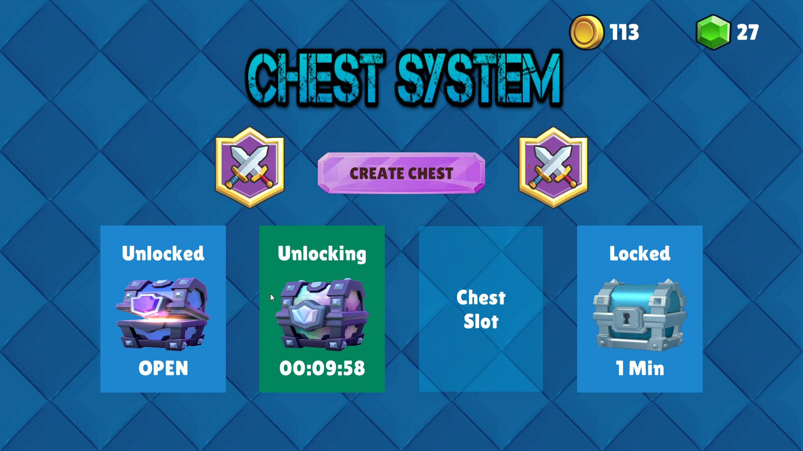

# Chest-System
 
### Introduction

    Chest System is a project that demonstrates a comprehensive chest system, inspired by Clash Royale's
    mechanics. This project places significant emphasis on maintaining code quality and ensuring the game's 
    adaptability for future enhancements.

### Features
    - Currencies: Manage two in-game currencies - Coins and Gems.
    
    - Chest Types: Support different chest types with highly configurable probabilities.
    
    - Chest Slots: Store up to four chests in your inventory.
    
    - Generate Chests: Randomly generate various types of chests to fill empty slots.
    
    - Chest Timer: Initiate a timer for unlocking chests.
    
    - Unlock with Timer: Choose to unlock chests after the timer completes.
    
    - Unlock with Gems: Spend gems to instantly unlock chests for immediate rewards.
    
    - Slot Availability: Get notified when your chest slots are full.
    
    - Chest States: Locked, Unlocking, Unlocked but uncollected chest states.
    
    - Reward System: Rewards based on the type of chest you unlock.
    
    - Queueing: Smartly queue chests for unlocking after the current chest's timer finishes.
    
### Screenshots
   
   
   
   
   
   
   
   
   
  
### Code Structure and Game Design

    Model-View-Controller-Service (MVC-S):
       - The Chest entity is structured around the Model, View, and Controller components.
       - A Service class efficiently creates and manages chests.

    Singletons:
        - Essential services, such as Chest Servicen, Slot Service and UI Service, are implemented as 
          singletons for centralized and efficient control.

    Scriptable Objects: Chest Types
        - Four distinct chest types are available: Silver, Gold, Legendary and Super Magical.
        - Each chest type is associated with different rarities and randomized rewards in terms of coins,
          gems, and unique chest unlocking times.

    State Pattern:
        - LOCKED state: Options to unlock using gems or initiate the unlocking timer.
        - UNLOCKING state: Gem-based instant unlocking or a countdown display until the chest is open.
        - UNLOCKED state: A prompt to open the chest, revealing rewards, with the chest disappearing 
          after collection.
       
#### Performance Optimization:
    - To optimize performance, object pooling is implemented for chests which helps manage memory and 
      CPU usage efficiently.

#### Chest System Design:
    - Used a background image and chest images that closely resemble the aesthetics of Clash Royale,
    
### Focus
    - Code Quality and Organization.
    - Architecture Design for Flexibility and Scalability.
    - Visually appealing, with soothing music and sound effects. 

### Gameplay Demonstration
    For a visual demonstration of the gameplay, watch video on YouTube:
   [Youtube video link](https://youtu.be/dWuikYUTAqs)

### Play the Game
    To experience the game firsthand, play it directly by following this playable link:
  [Play in browser(WebGl)](https://rahul-pargi.itch.io/chest-system)

 
